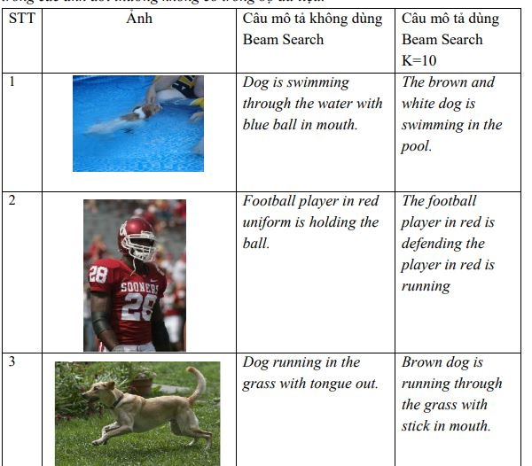
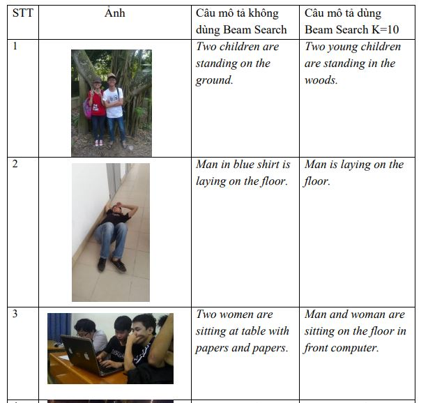
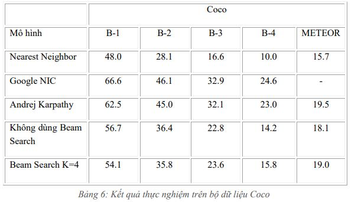

This is source code Generate descriptions for image
## Requirement

 * First create docker volume in host you want to setup: 
 ```bash
	Python 3.5,
    Numpy 1.14, TensorFlow 1.8, 
    win32com, scipy, gensim ,matplotlib, json, pickle
```
 
## Tutorials & Documentation

 * To use code run:
  ```bash
 	 demo.py: Generate descriptions for images in images images
 	 test_val.py: Generate description for test case in dataset
 	 To create a description for the sentence, paste the image into the images folder, run caption_image.py
 	 extract_feautures.py image encoding
 	 material.py encodes the sentence
 	 Modal file contains modal for model
 	 File reference generates reference sentences for measuring BLEU, METEOR
 	 File train.py perform the training
 ```
 * To update run:
 ```bash
	Replace dataset edit in material.py
	Change the number of laps, beam size edited in ultils.py file
pretrained folder contains word2vec
	weight_model folder contains weight_model for model
 ```
 


## Result 




## Slide
https://drive.google.com/file/d/1aZyr5cdtwLZc_80Acv67_MP1bWAtqn9J/view?usp=sharing
## Report
https://drive.google.com/file/d/1rMSxtAaRsWb4Bh4c6FSm-w850Ormcl19/view?usp=sharing

## Contributing

Questions about contributing, internals and so on are very welcome on the mail *tovanlam20132223@gmail.com*

